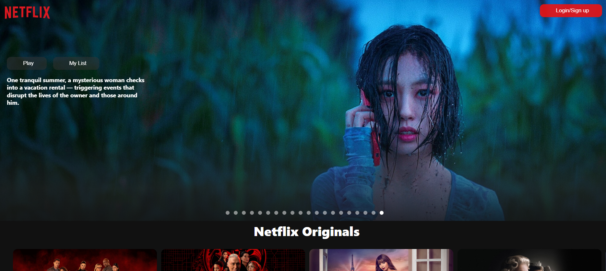
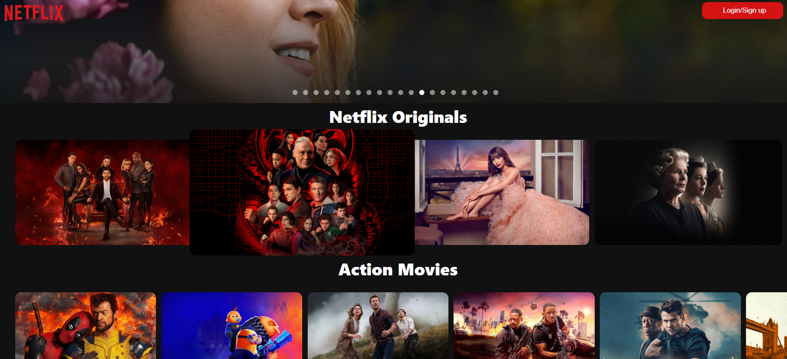
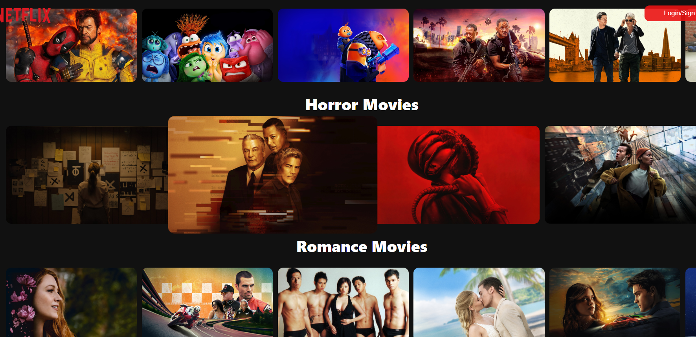

# Netflix Clone Website

Welcome to the Netflix Clone Website! This project is a web application built with React.js that emulates the Netflix experience by displaying movies with dynamic recommendations, trailers, and details. The site uses the TMDb (The Movie Database) API to fetch movie data and provides a user-friendly interface for exploring different movie categories.







## Features

- **Dynamic Movie Data**: Fetches movie details such as images, descriptions, and YouTube trailer links from the TMDb API.
- **Categorized Movie Listings**: Includes categories such as Action, Comedy, Romance, and more.
- **Periodic Recommendations**: Movie recommendations are updated periodically to reflect trending content.
- **Responsive Design**: Optimized for various devices and screen sizes.

## Technologies Used

- **React.js**: A JavaScript library for building user interfaces.
- **TMDb API**: Provides movie data including images, descriptions, and trailers.
- **REST API**: Utilized to communicate with the TMDb API.
- **Material-UI**: For icons and some styling elements.
- **CSS**: Custom styling for layout and design.

## Installation

To get started with this project locally, follow these steps:

1. **Clone the Repository**:
   ```bash
   git clone https://github.com/be19b028ramshidnk/Netflix-React-Project.git

2. **Navigate to folder**

3. **Install Dependencies**
* npm install 

4. **Setup AIP Key in TMDB website**
* https://developer.themoviedb.org/docs/getting-started

5. **Start the Development Server**
* npm start


### Acknowledgements
* TMDb API - For providing movie data.
* Material-UI - For icons and UI components.
* React - For building the user interface.